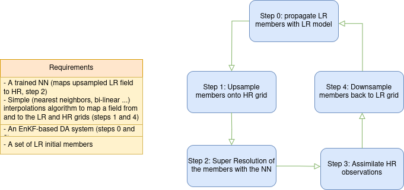
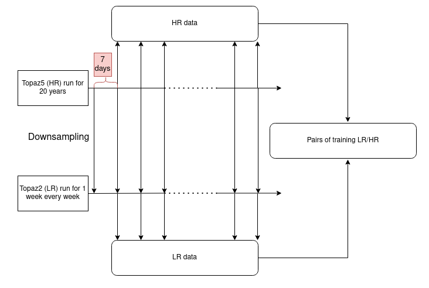

# Super Resolution Data Assimilation

This repo contains the Super Resolution Data Assimilation algorithm for the NECCTON project. It contains a notebook illustrating the super-resolution for a specific date and giving some metrics to compare against the truth and a baseline (bilinear upsampling).

  #### Description : 
A Neural Network allows to go from a low resolution field to a high resolution field to do data assimilation in the HR space, to then go back
in the LR dimension to run a LR model. To do so, the Neural Network computes the residuals it needs to add to a bilinear upsampling of the LR field to get the true HR field.

Once this NN is trained, the full algorithm follows this diagram:

The notebook given only illustrates Step 2. Indeed this work was developed for the specific application of running the TOPAZ data assimilation system, which is based on the coupling of HYCOM-CICE and ECOSMO (for the BGC)
- https://github.com/nansencenter/NERSC-HYCOM-CICE/tree/develop (HYCOM-CICE)
- https://github.com/pmlmodelling/ersem.git (carbon module)
- https://github.com/nansencenter/TOPAZ_ENKF_BIORAN_v2 (EnKF)

We also include the upsampling and downsampling algorithm in interpolation.py. Theey are specific to the TOPAZ system as well. Their purpose is to map a HR (respectively LR) variable to the LR (respectively HR) grid. Because
the land masks in HR and LR are not mere interpolation from one another, it requires special attention to map points that become water after interpolation but should be land and conversely. Similarly, specific methods are applied
to handle the difference in bathymetry and have the sum of the width of the vertical layers ("dp") reach exactly the bottom of the ocean.

Assuming a model and data assimilation scheme are operational, the scripts that connects the different steps is named Full_inference.sh. It consists in:
- upsamling
- applying the SR operator
- assembling the results (specific step for the binary .ab file format)

Then the script SRDA/downsample_back_to_TP2.sh is doing the Step 4.

# Usage

To run the super resolution algorithm and compare the result to a bsaline, open Test_ResUnet.ipynb and run all the cells . Recommanded: run it on EDITO [(Link)](https://dive.edito.eu/training?search=SRDA&path=%5B%5D) to avoid downloading the network weights and the fields.

## Training

The training was done on the super computer Lumi. The code is in training/training3V201_auto.py which is called by job_auto.sh, itself called by submit_job_auto.sh which is the job that is submitted to the queue.
The list of variables to super resolve as well as the layers are specified in job_auto.sh.

To create consistant pairs of training image we followed this method:

A long continuous run in HR is first done. Then every week, the output is downsampled (with the algorithm in interpolation.py) to the LR model grid. This LR model runs for 1 week from this initial conditions. At the end of the week we get 1 pair of matching HR and LR data.
Note that 1 week is chosen, among other reasons, between the assimilation window of TOPAZ is also of 1 week.

#### Choice of predictors

to predict the layer N of some variable, we use as predictors the LR variable at layers N-1, N and N+1 (except for the first and final layers, and for the super resolution of the "dp","u" and "v" variables, see training/submit_job_auto.sh). There is one trained network per variable and per layer.

## Data Source

The data required to run the Notebook are:

- High resolution fields (for validation)
- Low resolution fields upsampled to the the HR grid as an input of the neural network
- The High resolution land mask
- The weights of the NN

The HR and LR fields result from a run from the Topaz 5 and Topaz 2 data assimilation system respectively, which relies on a coupled ocean / sea-ice model (HYCOM / CICE) over the Arctic and the North Atlantic sea.
They are available through FTP (details provided in the code). For now, only the Sea Surface Temperature variable is available.

## Baseline

The superresolution with the residual U-Net is compared to bilinear interpolation.

## Metrics

The performance of the super-resolution model is evaluated using the following metrics:

### Bias
Bias indicates the systematic error in predictions, showing whether the model tends to overestimate or underestimate the true values. It is computed as the mean difference between predicted and true values. A bias close to zero suggests balanced predictions, while a significant bias indicates a systematic tendency in the model's predictions.

### Root Mean Squared Error (RMSE) and Peak Signal-to-Noise Ratio (PSNR) 
RMSE quantifies the difference between predicted and true values. It measures the average magnitude of the errors without considering their direction. Lower RMSE values indicate better model performance.

PSNR measures the ratio between the maximum possible power of a signal and the power of corrupting noise that affects the fidelity of its representation. It is simply a scaled log transformation of the MSE, but
is more commonly used in Super Resolution to quantify the quality of the results. The higher the PSNR value, the better the quality of the reconstruction.

### Structural Similarity Index (SSIM)
SSIM measures the similarity between two images. It considers three components: luminance, contrast, and structure. SSIM values range from -1 to 1, with 1 indicating perfect similarity. Higher SSIM values suggest better preservation of image quality.

## List of Dependencies
- Python version: 3.10.5
- TensorFlow version: 2.8.0
- abfile module (available in this repo)
- netCDF4 version: 1.5.8

## Citations and Links
(To be filled)
